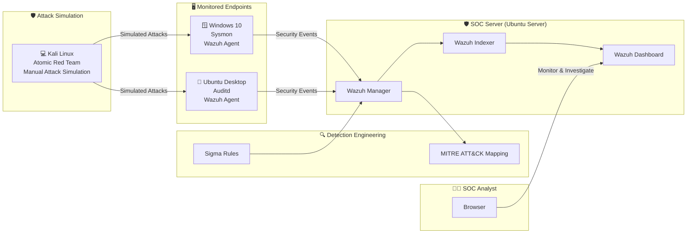

# mini-soc-detection-platform-
A hands-on SOC Detection Response Platform built using Wazuh, Elastic Stack, Sigma Rules, and MITRE ATT&CK.

# Overview
The **Mini SOC Detection & Response Platform** is a hands-on Security Operations Center (SOC) lab built to simulate real-world security monitoring, threat detection, and incident response. The project combines open-source security tools to collect endpoint telemetry, detect malicious activities using Sigma rules, visualize alerts through the Elastic Stack, and map detections to the MITRE ATT&CK framework.

The platform consists of a central Ubuntu Server hosting the Wazuh platform and Elastic Stack, monitored Windows and Linux endpoints running Wazuh agents, and a Kali Linux machine used to simulate cyber attacks. Attack scenarios are executed in a controlled lab environment to validate detections and improve security monitoring capabilities.

This project demonstrates practical SOC analyst skills including SIEM deployment, detection engineering, log analysis, threat hunting, MITRE ATT&CK mapping, dashboard creation, and incident response validation. It is designed as a portfolio project to showcase end-to-end SOC operations using industry-standard tools.

# Architecture

